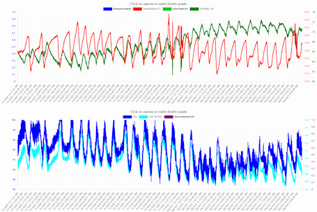
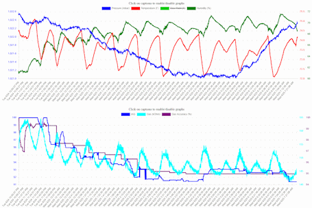
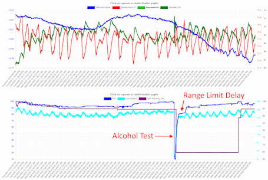

# SE BME680 Library
This is an extension of the [Adafruit BME680 Library](https://github.com/adafruit/Adafruit_BME680) to add temperature compensation, humidity compensation, a dew point calculation, and a basic IAQ (indoor air quality) calculation.


## Temperature and Humidity Compensation
The BME680 is well known to exhibit self-heating due to powering the sensor itself, its onboard heater, surrounding electronics, etc. Temperature compensation allows an offset to be specified to correct for this behavior. The specified temperature offset is also used to compensate humidity measurements. As temperature falls, measured humidity increases, and vice versa. Compensating both values can bring the measured temperature and humidity closer to actual ambient measurements.

The default temperature offset in this library is a good starting point. Fine-tuning the offset for a specific BME680 will require an appropriate burn-in time followed by hours or days of data collection to properly characterize the sensor against known references. 

## Dew Point
A dew point calculation is also provided and is based on the [Magnus formula](https://en.wikipedia.org/wiki/Dew_point#Calculating_the_dew_point). It is derived from the raw temperature and humidity measurements. Since the humidity compensation and dew point calculations are both based on Magnus transformations, there is no "compensated" dew point calculation. Dew point and "compensated" dew point would end up being identical values.

## IAQ (Indoor Air Quality)
The BME680 includes a MOX sensor that can be used to measure the presence of volatile organic compounds (VOC's) in the air. The sensor does exhibit some drift over time, making it less suitable as an absolute reference. But it is very responsive and can be used to calculate a relative air quality index. Bosch provides the closed-source BSEC library for this purpose. This library makes no attempt to emulate the BSEC calculations, complexity or accuracy, but instead offers a reasonable approximation using much simpler logic and open-source code.

IAQ in this library is reported as a percentage from 0-100%, representing "bad" to "good" air quality. BSEC also offers VOC and CO2 calculations. However, those calculations are derived from the same MOX resistance value and are therefore strongly correlated to the overall IAQ itself. When plotted on the same graph, all three calculations end up looking identical differing only in scale and units. This library does not attempt to replicate those additional calculations for that reason and simply focuses on the main IAQ.

### Sensor polling interval is IMPORTANT
IAQ logic depends on tracking the range of gas resistance values to determine where current readings fit within an observed range over time. However, the measured **gas resistance of the BME680 is heavily dependent on the polling interval**. The tracking logic can automatically adjust to reasonable polling intervals but cannot compensate for variations once a polling cadence has been established. Therefore, it is important to **ensure consistent polling intervals for the best possible IAQ calculations**.

The suggested approach is to use a timer:
```cpp
unsigned long lastPolled = 0, clock = 0;
while (true)
{
  clock = millis();
  if (clock - lastPolled >= 6000) // Poll every 6000ms (6 seconds), 10x per minute. 6000 is an arbitrary value for demonstration purposes only.
  {
    // Reset the timer
    lastPolled = clock;

    // Poll the BME680 first, before doing other things, to keep the timing as consistent and accurate as possible
    if (bme.performReading()) // Takes about 370ms, typically
    {
      float tc = bme.temperature_compensated; // Compensated temperature value, in Celsius
      float hc = bme.humidity_compensated; // Compensated humidity value, based on the specified temperature compensation
      float dp = bme.dew_point; // Dew point calculation, in Celsius
      float bp = bme.pressure / 100.0F; // Barometric pressure, in mbar
      if (bme.IAQ_accuracy > 0) // 0 = Unreliable, 1 = low accuracy, 2 = moderate accuracy, 3 = high accuracy, 4 = very high accuracy
      {
        float iaq = bme.IAQ; // Calculated IAQ as a percentage from 0-100% representing "bad" to "good"
      }
      uint32_t gr = bme.gas_resistance; // Ohms
      float gca = bme.getGasCalibrationAccuracy(); // Gas calibration accuracy from 0-100% representing "bad" to "good"
      int gcs = bme.getGasCalibrationStage(); // 0 = Initialization, 1 = burn-in, 2 = normal operating stage
    }

    //
    // Do other things here, taking care to ensure that these processes do not exceed the interval specified above (6000ms in this example)
    //

}
  delay(25); // Non-blocking delay on ESP32, in milliseconds
}
```

# How to use this library
It is intended to be a drop-in replacement for the Adafruit BME680 library. First, add this library to the Arduino IDE using the built-in library manager. Next, simply add the include and main object type in your sketch:
```cpp
#include <se_bme680.h>
SE_BME680 bme;
```
Follow the instructions provided for the Adafruit BME680 library to implement standard features and functionality as normal.

## Reading Compensated Values and Dew Point
The default temperature compensation can be overridden with `bme.setTemperatureOffset(degreesC);` where `degreesC` is an offset in degrees Celsius. A Fahrenheit-based offset can be conveniently specified with `bme.setTemperatureOffsetF(degreesF);`. These functions should be placed in `setup()`. Once specified, any subsequent measurements will leverage the new offset. All sensor readings can be accessed in the usual manner, including new properties:
```cpp
// Existing properties from the Adafruit library
float t = bme.temperature; // Raw temperature value from the base Adafruit library, uncompensated
float h = bme.humidity; // Raw humidity value from the base Adafruit library, uncompensated

// New properties provided by this library
float tc = bme.temperature_compensated; // Compensated temperature value, in Celsius
float hc = bme.humidity_compensated; // Compensated humidity value, based on the specified temperature compensation
float dp = bme.dew_point; // Dew point calculation, in Celsius
```
## Reading IAQ
Reading the IAQ measurement is slightly different since the accuracy must be verified first:
```cpp
// If IAQ is available
if (bme.IAQ_accuracy > 0) // 0 = Unreliable, 1 = low accuracy, 2 = moderate accuracy, 3 = high accuracy, 4 = very high accuracy
{
  // Use the IAQ value in your program
  float iaq = bme.IAQ; // Calculated IAQ as a percentage from 0-100% representing "bad" to "good"
}
```
IAQ will not be immediately available on sensor startup and/or after soft resets. It takes time for the gas resistance to stabilize and for the tracking logic to properly calculate a mean high value for resistance. After approximately 30 seconds of 1-second polling, a tentative IAQ will be available with low accuracy. At approximately 5 minutes of 1-second polling, the burn-in process should be completed and the confidence of the calculation will improve accordingly. Longer polling intervals will cause these first two stages to take more time, and it will likely take 30-60 minutes or more for readings to truly stabilize. The longer the sensor is running, the more stable the readings will become. Over long time periods, the gas resistance ceiling will typically drift, and the tracking logic attempts to compensate for such changes to maintain IAQ accuracy.

When accuracy = 0 the IAQ reading is meaningless and should not be used. It defaults to 50% but that value is arbitrary and should not be trusted. Higher accuracy levels depend simply on time and on the range of gas resistance ceiling values within the tracking algorithm.

If the sensor is started up in an environment with high VOC contaminants, the tracking algorithm should settle along a lower gas resistance boundary. That lower boundary is also enforced as the gas resistance drifts over time. This logic helps prevent self-calibration from reporting contaminated environments as "good", either initially or after prolonged exposure, but should not be relied upon as any kind of safety measure. 

## Donchian Smoothing (Optional)
Gas resistance is heavily influenced by ambient humidity. The IAQ calculation also references humidity, so oscillations in humidity have a compound effect on reported IAQ. Oscillations in humidity can come from cycling of air conditioners, heaters, etc. Temperature is also used in the IAQ calcuation and typically has similar oscillations. The net result is an IAQ that exhibits notable oscillations even when air quality may not have actually changed significantly.

Donchian Channels can be used to dampen oscillations by establishing a min/max range over time within which any oscillations are contained. These min/max "channels" are applied to gas resistance, humidity and temperature measurements. The channel center value of `(min+max)/2` is then used to calculate the IAQ. If an appropriate time period is selected, the channels will completely contain any measured oscillations and prevent them from translating to IAQ. The effect is a "smoothing" of the IAQ into a very stable metric.

Even though the Donchian Channel approach introduces computational "lag", it is still very responsive when any of the three values break out of the established min/max channel. If notable changes to air quality start to manifest, then gas resistance would likely break out of its channel and influence reported IAQ rather quickly, even if temperature and humidity remain within their channels.

This feature is optional and must be explicity enabled. Also, for it to work well, a value should be selected that compensates for any observed measurement oscillations. Data collection and experimentation will be required to fine-tune an appropriate value. Enable the feature in `setup()` as follows:
```cpp
bme.setDonchianSmoothing(true, 200); // With no range limits
bme.setDonchianSmoothing(true, 200, 2.5F, 3.5F, 12500.0F); // With range limits
```
The demonstration value of 200 is a reasonable starting point for a smoothing period. The parameter refers to the number of polling cycles. So, if polling is done every 6000ms (6 seconds), then the smoothing period is 6 X 200 = 1200 seconds of real time, or about 20 minutes. Adjust the value experimentally until IAQ oscillations just start to disappear or are reduced to acceptably low levels.

The second line shows how range limits can be specified for temperature, humidity and gas resistance (in that order). Range limits control how big a min/max channel can be. While the smoothing period should be chosen based on the time between oscillation peaks, range limits should be chosen based on the expected height ("range") of the oscillations from peak to valley. Smoothing periods are "horizontal" and range limits are "vertical". Values shown are good starting points for range limits. Zero can be specified for any of the three limits to disable range limiting for that metric.

Note that while Donchian smoothing is used to smooth humidity, temperature and gas resistance for use in the IAQ calculation, those smoothed values are NOT reported on the humidity, temperature or gas resistance properties of the library. Those properties will act the same regardless of whether Donchian smoothing is enabled or not. To be clear, Donchian smoothing ONLY affects the IAQ metric, and by extension, the gas calibration range. Nothing else is affected.

### Without Smoothing
[](assets/no-smoothing.png)<br/>
Without smoothing, IAQ tends to follow oscillations present in temperature, humidity and gas resistance.

### With Donchian Smoothing
[](assets/donchian-smoothing.png)<br/>
With Donchian smoothing enabled, and appropriate range limits configured, IAQ becomes very stable.

### Donchian Smoothing Responsiveness
[](assets/donchian-alcohol-test.png)<br/>
Even when Donchian smoothing is enabled, IAQ can still be very responsive. Demonstrated here is a test where the sensor was placed in an alcohol vapor chamber for a few minutes. As shown, IAQ dropped quickly and notably, yet was also able to recover reasonably fast. The "notch" at the top of the recovery curve is due to a combination of a range limit on the gas resistance plus the number of smoothing periods specified.

### Additional References
Donchian Channels are a concept used in technical analysis for stock charts:<br/>
https://www.investopedia.com/terms/d/donchianchannels.asp<br/>
https://en.wikipedia.org/wiki/Donchian_channel<br/>

The screenshot charts shown above were taken from an Ambient Sensor project which uses this library:<br/>
https://github.com/steveeidemiller/sensor-ambient<br/>

## Example Code
An example sketch is provided and can be found under "File->Examples->SE BME680 Library->se_bme680_test" in the Arduino IDE.

# Credits
The IAQ formula and algorithm in this library is a direct port of the Python code discussed at:<br/>
https://github.com/thstielow/raspi-bme680-iaq<br/>
https://forums.pimoroni.com/t/bme680-observed-gas-ohms-readings/6608/15<br/>

Full credit for the IAQ feature in this library goes to that project and the extensive research done by its author. The only modifications here are attempts to enhance the gas resistance tracking and stabilization approaches, but the equations are the same.

The author's formula includes a slope factor that was determined through experimentation. Fine-tuning the air quality calculation will require duplicating their approach to determine a more accurate slope factor for a specific BME680 sensor and target environment. 
