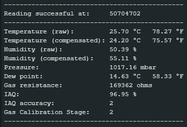

# SE BME680 Library
This is an extension of the [Adafruit BME680 Library](https://github.com/adafruit/Adafruit_BME680) to add temperature compensation, humidity compensation, a dew point calculation, and a simple IAQ (indoor air quality) calculation.



## Temperature and Humidity Compensation
The BME680 is well known to exhibit self-heating due to powering the sensor itself, its onboard heater, surrounding electronics, etc. Temperature compensation allows an offset to be specified to correct for this behavior. The specified temperature offset is also used to compensate humidity measurements. As temperature falls, measured humidity increases, and vice versa. Compensating both values brings the measured temperature and humidity closer to actual ambient measurements.

The default temperature offset in this library is a good starting point. Fine-tuning the offset for a specific BME680 will require an appropriate burn-in time followed by hours or days of data collection to properly characterize the sensor against known references. 

## Dew Point
A dew point calculation is also provided and is based on the [Magnus formula](https://en.wikipedia.org/wiki/Dew_point#Calculating_the_dew_point). It is derived from the raw temperature and humidity measurements. Since the humidity compensation and dew point calculations are both based on Magnus transformations, there is no "compensated" dew point calculation. Dew point and "compensated" dew point would end up being identical values.

## IAQ
The BME680 includes a MOX sensor that can be used to measure the presence of volatile organic compounds (VOC's) in the air. It only provides a single resistance value, so it has no selectivity for different gasses or alcohols. And the sensor does drift over time, so it's not an absolute reference. But it is very responsive and can be used to calculate a relative air quality index. Bosch provides the closed-source BSEC library for this purpose. This library makes no attempt to emulate the BSEC calculations, complexity or accuracy, but instead offers a reasonable approximation using much simpler logic and open-source code.

IAQ in this library is reported as a percentage from 0-100%, representing "bad" to "good" air quality. BSEC also offers VOC and CO2 calculations. However, those calculations are derived from the same MOX resistance value and are therefore strongly correlated to the overall IAQ itself. When plotted on the same graph, all three calculations end up looking identical differing only in scale and units. This library does not attempt to replicate those additional calculations for that reason and simply focuses on the main IAQ.

## Credits
The IAQ formula and algorithm in this library is a direct port of the Python code found at:<br/>
https://github.com/thstielow/raspi-bme680-iaq<br/>
https://forums.pimoroni.com/t/bme680-observed-gas-ohms-readings/6608/15<br/>

Full credit for the IAQ feature in this library goes to that project and the extensive research done by its author. The only modifications here are attempts to enhance the gas resistance tracking and stabilization approach, but the equations are the same.

The author's formula includes a slope factor that was determined through experimentation. Fine-tuning the air quality calculation will require duplicating their approach to determine a more accurate slope factor for a specific BME680 sensor and target environment. 

# How to use this library
It is intended to be a drop-in replacement for the Adafruit BME680 library. First, add this library to the Arduino IDE using the built-in library manager. Next, simply change the include and main object type in your sketch:
```
#include <se_bme680.h>
SE_BME680 bme;
```
Follow the instructions provided for the Adafruit BME680 library to implement standard features and functionality as normal.

## Reading Compensated Values and Dew Point
The default temperature compensation can be overridden with `bme.setTemperatureOffset(degreesC);` where `degreesC` is an offset in degrees Celsius. A Fahrenheit-based offset can be conveniently specified with `bme.setTemperatureOffsetF(degreesF);`. These functions are ideally placed in `setup()` but can actually be used anywhere in your program logic. Once specified, any subsequent measurements will leverage the new offset. All sensor readings can be accessed in the usual manner, including new properties:
```
// Existing properties from the Adafruit library
float t = bme.temperature; // Raw temperature value from the base Adafruit library, uncompensated
float h = bme.humidity; // Raw humidity value from the base Adafruit library, uncompensated

// New properties provided by this library
float tc = bme.temperature_compensated; // Compensated temperature value, in Celsius
float hc = bme.humidity_compensated; // Compensated humidity value, based on the specified temperature compensation
float dp = bme.dew_point; // Dew point calculation, in Celsius
```
## Reading IAQ
```
// Estimated IAQ calculation accuracy: 0=unreliable, 1=low accuracy, 2=medium accuracy, 3=high accuracy, 4=very high accuracy
if (bme.IAQ_accuracy > 0)
{
  // Use the IAQ value in your program
  float iaq = bme.IAQ; // Calculated IAQ as a percentage from 0-100% representing "bad" to "good"
}
```
IAQ will not be immediately available on sensor startup and/or after soft resets. It takes time for the gas resistance to stabilize and for the tracking logic to properly calculate a mean high value for resistance. After approximately 30 seconds, a tentative IAQ will be available with low accuracy. At approximately 5 minutes, the burn-in process should be completed and the confidence of the calculation will improve accordingly. The longer the sensor is running, the more stable the readings will become. Over long time periods, the gas resistance ceiling will typically decay, and the tracking logic attempts to compensate for such changes to maintain IAQ accuracy. 

When accuracy = 0 the IAQ reading is meaningless and should not be used. It defaults to 50% but that value is arbitrary and should not be trusted. Higher accuracy levels depend simply on time and on the range of gas resistance ceiling values within the tracking algorithm.

If the sensor is started up in an environment with high VOC contaminants, the tracking algorithm should settle along a lower gas resistance boundary. That lower boundary is also enforced as the gas resistance decays over time. This logic helps prevent self-calibration from reporting contaminated environments as "good", either initially or after prolonged exposure, but should not be relied upon as any kind of safety measure. 

## IMPORTANT
The gas resistance tracking and default slope factor are heavily dependent on polling frequency. It is strongly recommended that the sensor is polled roughly every second to ensure the best possible IAQ accuracy. 

## Example Code
An example sketch is provided and can be found under "File->Examples->SE BME680 Library->se_bme680_test" in the Arduino IDE.
